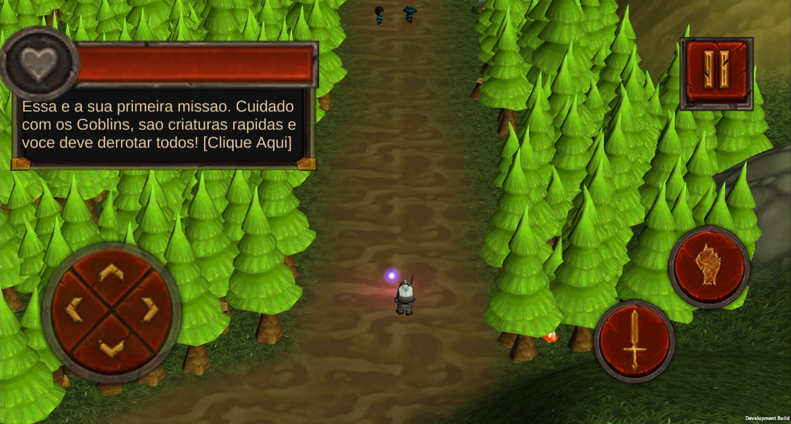

# TGC
Developed in group a complete mobile game as reference for my final paper project at Fatec University

#Project Purpose

At 2015 my group decided to develop a full mobile game at the final paper project at University (Fatec Jundiaí).

#Project Description

We wanted to develop an adventure game genre at the middle Ages. Our hero should fight against big monsters and small but fast goblins to recover his honor.

Some Features developed for this game:
- Sword Attack: using Raycast;
- "Spell" or Power Ball: the player can cast a this spell and a gameobject is created with a constant velocity until it collides with an enemy or during the cast time;
- Health Potion: Some Potions can be found during the game and recover the Hero`s Health;
- Boss: We created a giant boss that can spawn more enemies while you don`t defeat him;
- Survivor mission: A Classic survivor arena where the player must fight againts enemies waves and try to beat their own score (the best score is saved locally)
- Four missions with different objectives.

#Considerations

Unfortunatelly, as some of those assets were purchased, i was not able to publish the full project here. But I recovered the scripts and they can be found here: 
(https://github.com/gustavo-afs/TGC/tree/main/Scripts)

You can also Download the app and install at your Android Device using this Link here: (https://drive.google.com/file/d/1mvvAL1a0fttMWWPePjYfo05s6-tHprRt/view?usp=sharing)

The missions are locked until the player beats the first missio, then all other missions are available to be played (this was a request of the University so they could test the whole game without need to beat it entirely)

